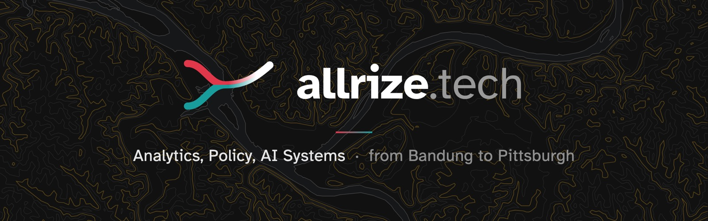

<h3 align="center">Rizaldy Al Kautsar Utomo</h3>

I spent seven years at Telkomsel, where analytics from 170 million phone users fed products, revenue and policy calls on digital equity in Indonesia. Now I'm at Carnegie Mellon on an LPDP scholarship, learning how to make AI close the equity gap in developing nations, not widen it.

  <a href="https://allrize.tech"><strong>allrize.tech</strong></a> ·
  <a href="https://allrize.tech/assets/resume.pdf">Resume (PDF)</a> ·
  <a href="https://www.linkedin.com/in/rizaldykautsar/">LinkedIn</a> ·
  <a href="mailto:rutomo@andrew.cmu.edu">rutomo@andrew.cmu.edu</a>

## Now

- **Carnegie Mellon University, Heinz College.** MS Public Policy & Management, Data Analytics, with a concentration in AI Management. GPA 3.94, expected May 2027.
- **Teaching assistant** for 90-710 Applied Economic Analysis and 94-844 Generative AI Lab.
- **Summer 2026 · Urban Redevelopment Authority of Pittsburgh.** Built an in-house geospatial monitoring platform that replaced a $15,000-a-year survey subscription, then handed the GIS team an agent-ready repo so they can keep shipping without a dedicated engineer.
- **2018 to 2025 · Telkomsel**, Southeast Asia's largest telco (170M users). Built the data team behind a USD 11M-a-year insights line, cut mobility pipeline delivery from 4 days to 16 hours, and shipped econometric models behind a 6% revenue lift.

**Open to** AI safety, geospatial intelligence and solution architecture roles. Remote projects now, full-time from 2027.

## Recently shipped

| | What it is | Links |
|---|---|---|
| **Vitamin Bob** Oct 2026 🏆 1st, Health | Primary care triage over a free missed call. Gemma 4 runs offline on one laptop; fixed rules, not the model, set the urgency. Built with a team of four. **Winner, Health track** of the World Bank's *Small AI for Development* Youth Hackathon, out of 8,000+ applicants. Headed to Seoul to present at the World Bank Group's Global AI and Digital Summit. | [Site](https://vitamin-bob.vercel.app/) · [Data story](https://rzrizaldy.github.io/vitamin-bob/) · [Code](https://github.com/rzrizaldy/vitamin-bob) |
| **MapTruth** Sep 2026 | AI designs the map, OpenStreetMap keeps it true. WebMCP-grounded map art, because a made-up map looks exactly like a real one. | [Site](https://map-truth.vercel.app) · [Demo](https://youtu.be/cMuCQtug00M) · [Code](https://github.com/rzrizaldy/map-truth) |
| **twin.md** 2026 | A local-first companion for your Obsidian vault. Built at Anthropic's invite-only *Build with Opus 4.7* hackathon, selected from 10,000+ applicants; won $500 in credits. | [Site](https://rzrizaldy.github.io/twin_md/) · [Code](https://github.com/rzrizaldy/twin_md) |
| **Tuyul** private | A small autonomous trading desk run by AI agents over MCP: narrow roles, shared memory, hard guardrails, a human yes on every sell, and a journal that CI audits. | [How it works](https://allrize.tech/#tuyul) |

## Civic data and maps

- **Pittsburgh 311 intake and routing** team of four · Fall 2026 · Can an LLM-assisted intake and routing API shorten how long Pittsburgh takes to resolve 311 requests? I built the waste and neighborhood cleanliness corpus from the WPRDC 311 archive, with human labels and a baseline LLM evaluation; the four corpora merge into an 854-record knowledge base for grounding and fine-tuning.
- **[Pittsburgh Night Market Explorer](https://rzrizaldy.github.io/cmu_f26_data_to_action_nightmarket_dashboard/)** team of four · Fall 2026 · Which neighborhood, on which date, should host the next night market? Ridge regression predicts footfall from population, businesses, bus ridership and spending, then an integer program picks the schedule.
- **Chicago crash severity** private · team of three · 328,495 crashes from 2023 to 2025. A random forest flags severe outcomes (AUC 0.84), and empirical-Bayes scoring ranks 91,616 location and condition profiles into a priority list for the city's transport department.
- **[PGH Transit Atlas](https://rzrizaldy.github.io/pgh-transit-atlas/)** · POGOH bikeshare meets 7,075 bus stops; K-means finds four kinds of rider
- **[NYC Transit Access](https://nyc-transit-intel.netlify.app)** · 311 complaints and NYPD data rolled into a Transit Desert Index across 2,327 census tracts
- **[Chicago Crash Intel](https://rzrizaldy.github.io/chicago_crash_dashboard/)** · grid-cell crash risk that flags Chicago's 206 riskiest blocks
- **[JKT Drivetime](https://rzrizaldy.github.io/jkt-drivetime/)** · Greater Jakarta drive-time map

## Built for people I care about

- **[BukuGambar.AI](https://colorize.allrize.tech/)** · turns text or a photo into a coloring page. Built for my sons, used by other parents too.
- **[Quran Turn](https://quran.allrize.tech)** · a Claude Code and Codex plugin that opens a quiet, offline Qur'an reader while your coding agent works. Exact Tanzil text, no account, no tracking. ([code](https://github.com/rzrizaldy/quran-turn))
- **[LPDP CTRL+F](https://lpdpfind.allrize.tech)** · search 28,007 programs to find the university that fits your LPDP scholarship
- **[Gelitik](https://gelitik.allrize.tech)** · traffic-to-revenue attribution for Indonesian builders (founder, in beta)

## Recognition

- **1st place, Health track**, Small AI for Development Youth Hackathon, World Bank Group, 2026 · [Vitamin Bob](https://github.com/rzrizaldy/vitamin-bob), chosen from 8,000+ applicants worldwide; invited to present at the Global AI and Digital Summit 2026 in Seoul
- **2nd place**, Pittsburgh AI Safety Hackathon, Carnegie Mellon, 2026 · policy analysis of AI-enabled mass surveillance ([slides](https://allrize.tech/assets/hackathon-ai-policy.pdf))
- **Selected from 10,000+ applicants**, Build with Opus 4.7 Hackathon, Anthropic, 2026 · invite-only, one week; won $500 in credits with [twin.md](https://github.com/rzrizaldy/twin_md)
- **1st place**, Prompt-a-Thon, Microsoft Indonesia, 2025
- **LPDP Scholarship**, full ride for a master's degree, Indonesia Endowment Fund, 2024

## Tools

**Languages** · Python, SQL, PySpark, R, JavaScript 
**Agentic development** · Claude Code, Codex, MCP, multi-agent orchestration, RAG, fine-tuning 
**GIS** · ArcGIS Pro, QGIS, Leaflet 
**Data viz** · Tableau, Power BI, Streamlit, Plotly, d3 
**Data** · PostgreSQL, MySQL, MongoDB, Hadoop

## The mark

<picture>
  <source media="(prefers-color-scheme: dark)" srcset="assets/allrize-mark-dark.svg">
  
</picture>

**Confluence.** Two streams, red above and teal below, run side by side, then fade into one stroke that rises to the right. It stands for the three rivers meeting at the Point in Pittsburgh, for social science meeting technology, and for the road from Bandung to Pittsburgh.
 
